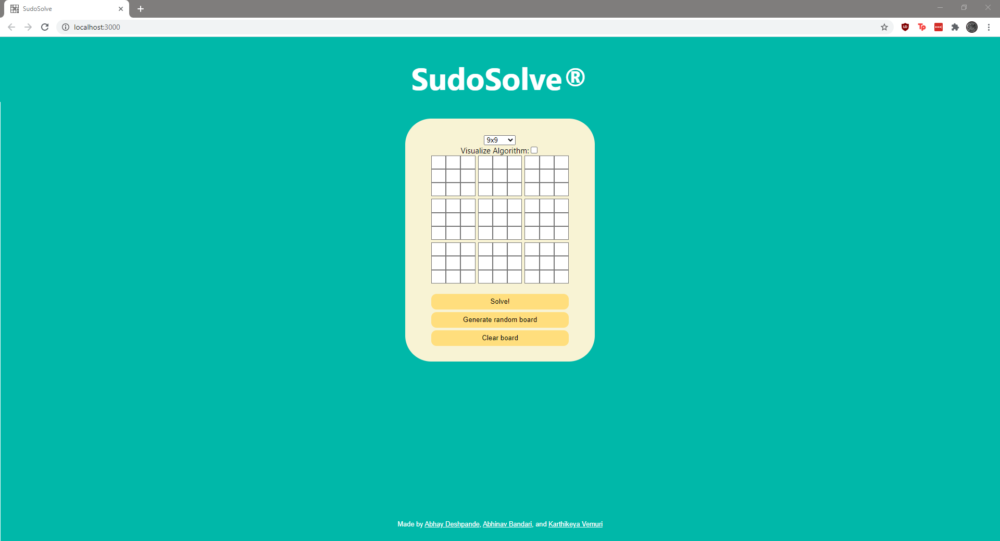

# Sudoku Solving Algorithm
All of our approaches are recursive backtracking algorithms.

## Initial Algorithm
1. Find an arbitrary unsolved square. 
2. Find said square's possible values, given the values already in the same column, same row, and same "sub-grid". If there are no possible values for this square, we backtrack.
3. For each of the possible values, fill the square with that value and recurse (repeat steps 1-3 until no unsolved squares are found). If none of the possible values with which we can fill this square result in a solution for the entire board, we backtrack.

## Modified Algorithm
### Main Improvements
Let's precompute the sets of possible values for each unsolved square prior to
the recursion. As we solve squares, let's update the sets of possible values
for the affected squares.

### Full Algorithm
1. Compute sets of all possible values for each of the board's unsolved
   squares. 
2. Find an arbitrary unsolved square.
3. For each value in the precomputed set of possible values for said square,
   fill the square with that value and update the sets of possible values for each of the affected squares (all squares in the same column, same row, and same sub-grid as the original square).
   square. Then, recurse. 
4. If the set of possible values for an unsolved square is empty, we backtrack
   because at least one of the squares we filled previously is incorrect. If none of the possible values with which we can fill this square result in a solution for the entire board, we backtrack.

## Final Algorithm
### Main Improvements
Instead of solving the squares in an arbitrary order, let's find the square
with the least candidate values, solve it, and repeat until entire board is
solved. 

### Full Algorithm
1. Find candidate values for each of the board's unsolved squares.
2. If any unfilled square has zero candidates, backtrack.
3. Determine the square with least number of candidates.
4. For each of the candidate values, fill said square with that value.
5. If the board is now solved, return.
6. Otherwise, recurse and repeat steps 1-5 until board is either solved or determined to be completely unsolvable.

# Communication between UI and Solver

To prevent the solver from hogging resources from the UI thread, the solver algorithms run on a separate web worker process. This is better than simply using `async` functions, because `async` functions don't use true multithreading. Instead, `async` functions simulate parallel processing by frequently yielding control of the thread while the interpreter switches back and forth between multiple code paths. In contrast, a web worker actually runs on its own thread, completely separate from the UI thread. Since it never has to yield control of the thread to any other code paths, the overhead of context switching is eliminated, so the solver algorithm can run faster and more efficiently.

Communication between web workers and the main UI thread happens through "messages". We defined a simple protocol through which the UI thread and web worker can work together. When the UI thread wants to solve a board, it serializes the board and sends it, along with a few other parameters, to the web worker. One of these parameters will tell the worker whether the UI wants periodic updates of the solver state, which will be used to visualize the solver algorithm.

The web worker then accepts and deserializes the message from the UI thread. There are 2 different response types from the web worker. There are `update` messages, which indicate the the puzzle is still being solved, and include a serialized copy of the board in progress. This can be used to display the visualization to the user. The other message type is `solution` messages. These messages show that the board has either been solved or determined to be unsolvable. It also includes a serialized copy of the solved board (or null if the board is unsolvable) which the UI can then display to the user.

By communicating using this protocol, the UI thread and the web worker work together to send events back and forth, accomplishing parallel tasks and keeping the UI lag-free.

# User Interface

The frontend was built using React.js, and communicates with the solver algorithms (which run on a separate web worker) via messages.

## Controls

We designed the controls to be as intuitive and self explanatory as possible. Each button is very clearly labeled with an explanation of what it does.

To make the UX easier, we also do automatic input validation when users are filling out the sudoku board. Each board size has valid characters. For example, `4x4` boards only accept characters in the range `1-4`. We designed the UI such that the user is unable to enter invalid characters. This makes it much harder to pass malformed or invalid input.

Additionally, when the solver algorithm is running, all user input is locked and disabled. This makes it impossible for the user to edit the board while it's being solved. This occurs both when it is solving a board, and when it is generating a random board. Essentially, when the webapp is going to overwrite the contents of the board, the user is locked out from editing the board. This makes it so that at no point will user input be accidentally overwritten.

### Visualizer

You can also optionally visualize the backtracking algorithm at work. This option is by default disabled since it slows down the solver quite a bit (so it can operate at a speed that humans can see), but you can enable it before solving by enabling the check box. Once the algorithm starts solving, you will see what values it is trying to place in which squares.

We included this feature so that users can see the underlying decision making process that our algorithms use. To use this, we needed to be able to "hook" the solver algorithm back into the UI so it could display the board while it's solving it. We accomplished this by designing multiple message "types", which the web worker process can us to communicate with the UI thread. `update` messages tell the UI that the solver algorithm is still working, but includes a serialized board to display to the user. `solution` messages communicate that the solving process is done, and includes a serialized board which represents the solved board.

### Dispatching events to the Solver

When you click solve, the solving algorithm gets to work! All input is disabled while the solver is working, to prevent any user input from getting overwritten. When the solver starts, the UI thread serializes the board and dispatches it to the web worker where the solver algorithm is running. On the web worker, the solver can run without fear of blocking or lagging the UI thread.
